# Backend Documentation

## Table of Contents

1. Introduction
2. System Architecture
3. Development Process
4. Features and Endpoints
5. Database Schema
6. Deployment Process
7. Error Handling
8. Third-party Integrations
9. Security Considerations
10. Testing
11. Future Improvements
12. Appendix
13. References

## 1. Introduction

- **Purpose**: This is the Golang backend with Gin and GORM framework, for the Movie Recommendation App powered by GPT API.

## 2. System Architecture

- **Overview**
  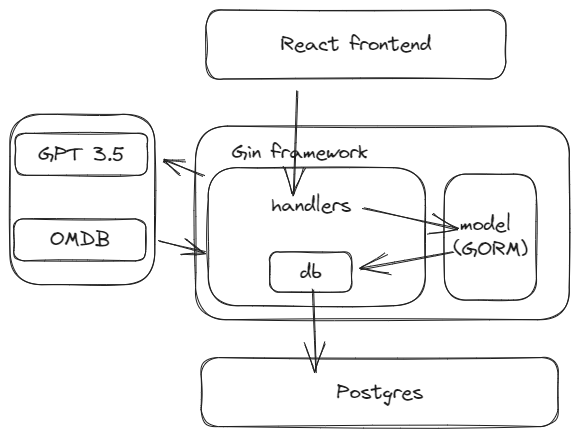

  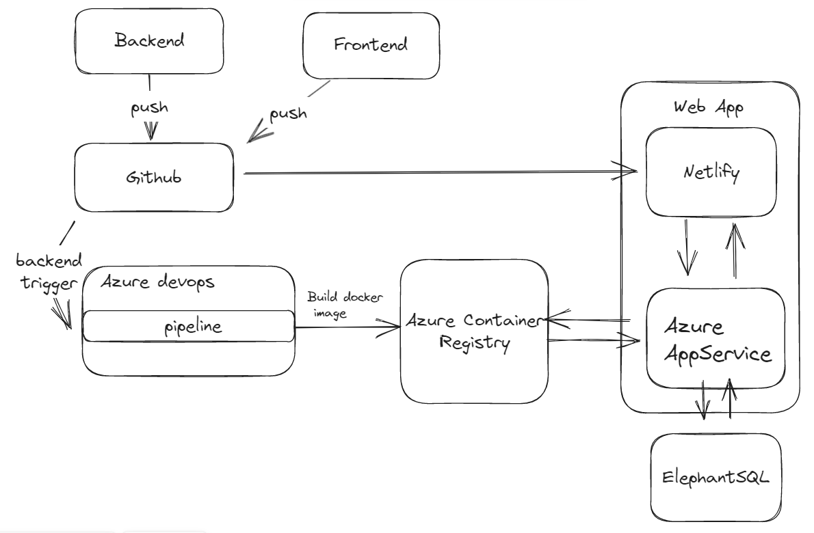

## 3. Development Process

### Enviroment Setup

Install Go, set up main.go, run go mod init with name or github url. Implement Gin framework `"github.com/gin-gonic/gin"`

```go
package main

import (
	"github.com/gin-gonic/gin"
)

func main() {
	r := gin.Default()
	config.AllowMethods = []string{"GET", "POST"}            // Specify what methods should be allowed
	config.AllowHeaders = []string{"Origin", "Content-Type"} // Specify what headers should be allowed

	api := r.Group("/api")
	{
		api.POST("/recommendations", handlers.GetRecommendations)
		api.POST("/playlists", handlers.CreatePlaylist) // Create playlist
		api.GET("/playlists", handlers.GetPlaylists)
		api.GET("/playlists/:id", handlers.GetSinglePlaylist)

	}

	r.Run() // listen and serve on 0.0.0.0:8080
}

```

Implement handlers in separate folder called handler, name the file `package handlers`, so other files could access by `movie-recommendation/handlers`.

```go
import (
	"github.com/gin-gonic/gin"
)
type RecommendationRequest struct {
	Prompt string `json:"prompt"`
}
func GetRecommendations(c *gin.Context) {
	var request RecommendationRequest
	if err := c.ShouldBindJSON(&request); err != nil {
		fmt.Println("Error binding JSON:", err)
		c.JSON(http.StatusBadRequest, gin.H{"error": err.Error()})
		return
	}
```

gin.Context represents the context of an HTTP request received by a server. By declaring a variable c with the type *gin.Context, one can access various information and perform operations related to the HTTP request

uses the `ShouldBindJSON` method provided by the `gin.Context` object to bind(extract data from an HTTP request's body and bind it to a struct variable named `request`) The `&request` syntax is used to pass a reference of the `request` struct to the `ShouldBindJSON()` method, allowing it to modify the struct in-place.the request body JSON data to the `request` variable, makes it easy to access and type safety.

##### Requesting to OpenAI API

Tried to use the Go library: https://github.com/sashabaranov/go-openai/issues/467

but connection issue persist even uses the proxy setting feature they proposed, hence changed to a native http call.

```go
	reqBody := map[string]interface{}{
		"model": "gpt-3.5-turbo",
		"messages": []map[string]string{
			{
				"role":    "system",
				"content": "You are a helpful assistant.",
			},
			{
				"role":    "user",
				"content": request.Prompt,
			},
		},
	}
```

declares a map in Go programming language. It is a data structure that stores a collection of key-value pairs, where the keys are of type `string` and the values can be of any type (`interface{}`)

```go
// marshals the reqBody JSON object into a byte array using the json.Marshal function
reqBytes, err := json.Marshal(reqBody)
if err != nil {...}

// bytes.NewBuffer() function initializes a new buffer with the contents of the reqBytes byte array. By creating a buffer from the byte array, easily read data from reqBytes using methods provided by the Buffer.
req, err := http.NewRequest("POST", "https://api.openai-proxy.com/v1/chat/completions", bytes.NewBuffer(reqBytes))
if err != nil {...}
```

uses a proxy https://api.openai-proxy.com/v1/chat/completions that finally worked.

Below loads the api key and creates an HTTP client and makes a request using the client

```go
import ("github.com/joho/godotenv")
...
er := godotenv.Load()
if er != nil {
	fmt.Println("Error loading .env file")
}

apiKey := os.Getenv("API_KEY")
req.Header.Set("Content-Type", "application/json")
req.Header.Set("Authorization", apiKey)

//creates an HTTP client object using the http.Client struct and assigns it to the client variable. Then, it sends an HTTP request using the client's Do method
client := &http.Client{}
resp, err := client.Do(req) // receives a response from the server, which includes a response body.
if err != nil {...}
defer resp.Body.Close()

body, err := ioutil.ReadAll(resp.Body) // extract the actual content of the response. reads the entire content of the response body and returns it as a byte slice ([]byte). directly assigning resp.Body to a variable like body, err := resp.Body will give you a ReadCloser interface (decided by http package). 
if err != nil {...}
```

```go
// designed to match the structure of the JSON response received from the OpenAI API.
type OpenAIResponse struct {
	Choices []struct {
		Message struct {
			Content string `json:"content"`
		} `json:"message"`
	} `json:"choices"`
}
...
var aiResp OpenAIResponse
err = json.Unmarshal(body, &aiResp) //converting a JSON string into Go data structures. The JSON data is unmarshaled based on the provided JSON tags in the struct fields.
if err != nil {...}

// error catching
if len(aiResp.Choices) == 0 || aiResp.Choices[0].Message.Content == "" {...}

// As OpenAI returns stringified JSON in response, unmarshal it into the appropriate structure
type MovieResponse struct {
	Movies []Movie `json:"movies"`
}
...
var movieResponse MovieResponse
// further decode the content of the first message into a more specific Go structure (movieResponse)
err = json.Unmarshal([]byte(aiResp.Choices[0].Message.Content), &movieResponse)
if err != nil {...}
```

1. unmarshal a JSON response stored in the body variable into the aiResp variable
2. check for content validity
3. `[]byte(aiResp.Choices[0].Message.Content)`,converts the content of the message at first choice within the aiResp object into a byte array. It is necessary to convert the content to byte array before passing it to json.Unmarshal().
   The second argument, &movieResponse, is a pointer to the variable movieResponse where the decoded JSON data will be stored.

It is not sure why the library did not work, but luckly native http call and set API Key as Auth header works.

##### Cors

```go
import("github.com/gin-contrib/cors")
config := cors.DefaultConfig()
config.AllowAllOrigins = true   
```

##### Playlist feature and database setup

Download Postgres: https://www.enterprisedb.com/downloads/postgres-postgresql-downloads

Download PgAdmin4: https://www.pgadmin.org/download/pgadmin-4-windows/

> Seems like PdAdmin4 can be included in Postgres installation

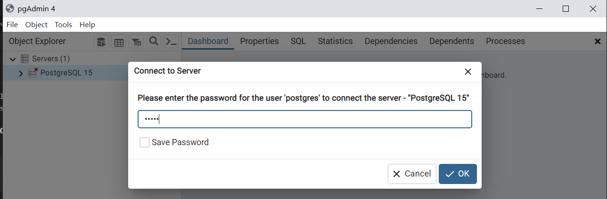

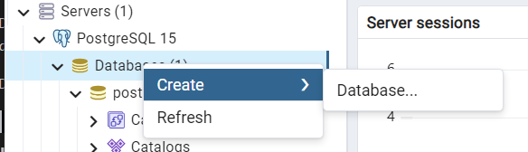

> Todo: .env

Create new handler file, new `db.go` in a separate db folder.

Local connection:

```go
host := os.Getenv("HOST")
	user := os.Getenv("USER")
	dbname := os.Getenv("DBNAME")
	password := os.Getenv("PASSWORD")

	dsn := fmt.Sprintf("host=%s user=%s dbname=%s password=%s sslmode=disable", host, user, dbname, password)
```

```go
package db

import (
	"fmt"
	"movie-recommendations/models"
	"net/url"
	"os"
	"github.com/joho/godotenv"
	"gorm.io/driver/postgres"
	"gorm.io/gorm"
)

func ConnectDB() (*gorm.DB, error) { //pointer to gorm.DB and an error object.
	er := godotenv.Load()
	if er != nil {
		fmt.Println("Error loading .env file")
	}

	connectionURL := os.Getenv("DATABASE_URL") // Assuming DATABASE_URL is the name of your env variable containing the URL
	parsedURL, err := url.Parse(connectionURL) //The url.Parse() function takes a URL string as input and returns a pointer to a url.URL struct that contains several components that represent different parts of the URL.
	if err != nil {
		return nil, err
	}
	password, _ := parsedURL.User.Password()
	host := parsedURL.Hostname()
	user := parsedURL.User.Username()
	dbname := parsedURL.Path[1:] // Trim the leading "/"

	dsn := fmt.Sprintf("host=%s user=%s dbname=%s password=%s sslmode=require", host, user, dbname, password)
	var connectionErr error
	// postgres.Open(dsn): This function call sets up the PostgreSQL driver
	// gorm.Open(postgres.Open(dsn), &gorm.Config{}): The gorm.Open function is responsible for opening the database connection and configuration options provided by
	DB, connectionErr = gorm.Open(postgres.Open(dsn), &gorm.Config{})
	if connectionErr != nil {
		return DB, connectionErr
	}
	// automatically creates any necessary database tables and updates existing tables based on the models Playlist and Movie.
	DB.AutoMigrate(&models.Playlist{}, &models.Movie{})
	return DB, nil
}
```

https://pkg.go.dev/net/url
When deploying, it is foten provided a connection string, and when it doesn't match the common convention of dsn, do some extraction to get individual values.

Close DB connection and initialize global reference of DB:

```go
var DB *gorm.DB
func CloseDB() {
	db, err := DB.DB() //get the underlying database connection from the database object.
	if err ...
	err = db.Close()
	if err ...
}
```

In main.go:

```go
_, err := db.ConnectDB()
if err != nil {
	fmt.Printf("Failed to initialize database: %v", err)
}
defer db.CloseDB()
```

##### Playlist endpoints

```go
import (
	"movie-recommendations/db"
)
func CreatePlaylist(c *gin.Context) {
	var req PlaylistRequest
	if err := c.ShouldBindJSON(&req); err != nil {
		c.JSON(http.StatusBadRequest, gin.H{"error": err.Error()})
		return
	}
	playlist := models.Playlist{
		Name:   req.Name,
		Movies: req.Movies,
	}
	// db is the package, DB is the database object
	db.DB.Create(&playlist)

	c.JSON(http.StatusCreated, gin.H{"data": playlist})
}

func GetPlaylists(c *gin.Context) {
	var playlists []models.Playlist
	db.DB.Preload("Movies").Find(&playlists)
	c.JSON(http.StatusOK, gin.H{"data": playlists})
}

func GetSinglePlaylist(c *gin.Context) {
	var playlist models.Playlist
	id := c.Param("id")
	db.DB.Preload("Movies").First(&playlist, id)
	c.JSON(http.StatusOK, gin.H{"data": playlist})
}

```

Pretty self explanatory actually.
The Preload method is used to eagerly load the Movies relationship for each playlist, which means that when the playlists are returned, their associated movies will also be included so that it is available without making additional queries.. The Find method is used to query the database and retrieve the playlists. The &playlists argument is a reference to a variable where the query results will be stored.

```go
type Playlist struct {
	gorm.Model
	Name   string  `gorm:"size:255;not null" json:"name"`
	Movies []Movie `gorm:"many2many:playlist_movies;" json:"movies"`
}
```

if we don't use the Preload("Movies") function, the Movies field of the Playlist struct will be empty.

> Btw, if we want Playlist to have same names, remove the unique keyword in the ``part.

##### Docker file (with fix history)

Place docker file in the root of the backend folder

```
# Use an official Go runtime as the parent image
FROM golang:1.20

# Set the working directory
WORKDIR /go/src/app

# Copy the current directory contents into the container
COPY . .

-# Download all dependencies
-RUN go get -d -v ./...
-
-# Install the app
-RUN go install -v ./...
+# Build the Go application
+RUN go build -o app .

+# Ensure the binary is executable
-RUN chmod +x app


# Make port 8080 available to the world outside this container
EXPOSE 8080

# Run the app
-CMD ["app"]
-+CMD ["./app"]
+CMD ["/go/src/app/app"]
```

- Instead of using the "go install" command to install the application, the "go build" command was used to build the application and generate an executable binary named "app" in the current working directory.
- The line "-RUN chmod +x app" which was used to make the binary executable has been removed since the binary is already generated by "go build".
- The CMD statement was changed from 'CMD ["app"]' to 'CMD ["/go/src/app/app"]' to specify the full path of the binary file.

These changes ensure that the binary file is properly built and located in the expected path, and the CMD statement correctly points to the binary when the container starts.

### Deployment


##### 1. Set up Resource Group

##### 2. Set up Azure Container Registry

ACR need to be set up first as other services are depending it.

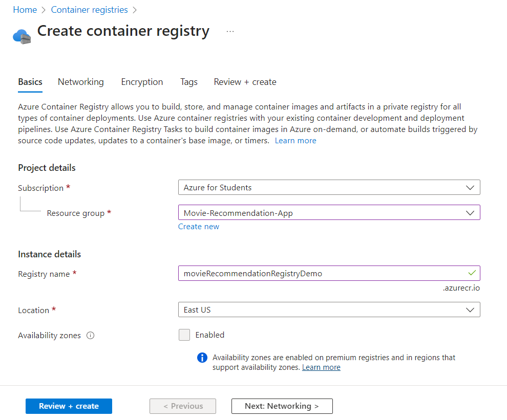

##### 3. Set up Pipeline

1. Create new Project
2. Create new Pipeline
   1. Connect: Select Github for Where is your code
   2. Configure your pipeline: choose Docker: Build and push an image to ACR.
   3. Select which ACR will be pushed to
   4. It will detect dockerfile and generate its path
   5. It will generate a YAML file to be commited to the repo.

```yaml
trigger:
  branches:
    include:
    - main
  paths:
    include:
    - backend/*
    exclude:
    - frontend/*
```

Add the above line to exclude the change in frontend.

Save the pipeline, next time it commits, a docker image will be build and push to ACR - will it work tho?

##### Set up Azure App Service

1. Create - Web App
2. 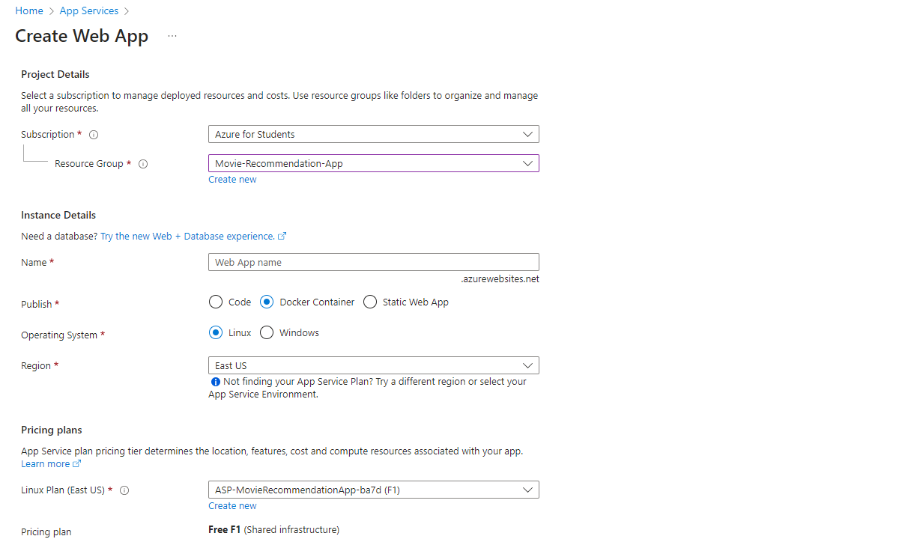
3. 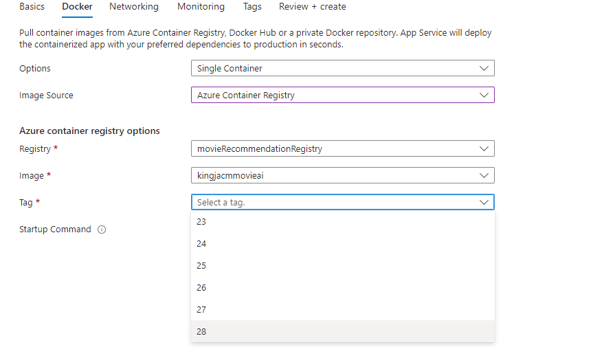

##### Explore App Service

Add .ENV variables

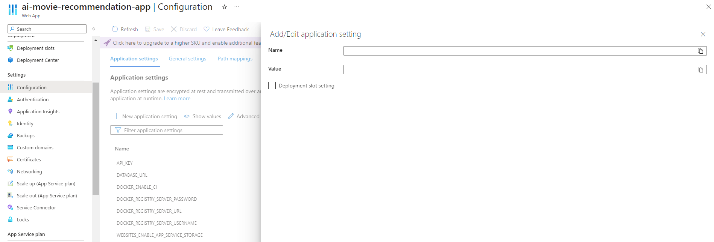

Open logging

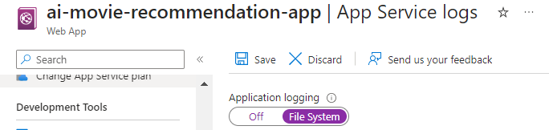

Access backend logs in log stream

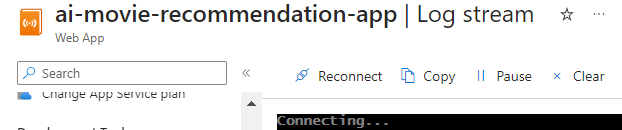

Access the deployment status in Deployment Center, note that sometimes new Tag will not be automatically used.

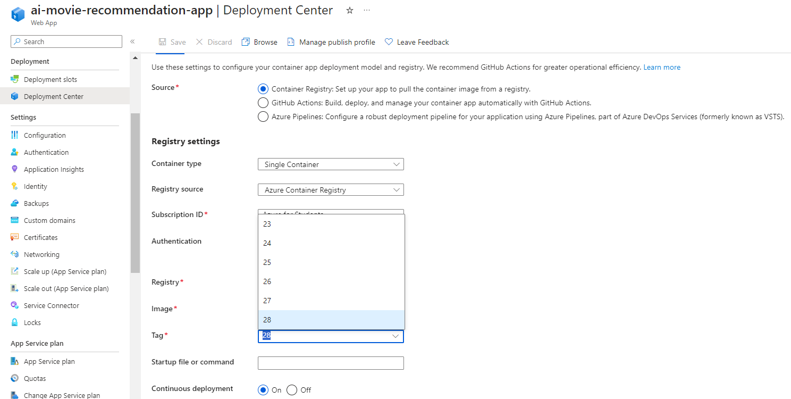


## 4. Features and Endpoints

For each feature, provide:

- **Endpoint**: URL and HTTP method.
- **Description**: Brief about what the endpoint does.
- **Request Parameters**: Required parameters and their types.
- **Response**: What's returned to the client.
- **Errors**: Possible error messages and their meanings.

## 5. Database Schema

- **Overview**: Type of the database used (SQL, NoSQL).
- **Tables/Collections**: For each table/collection, list fields, types, and relationships (if applicable).
- **ER Diagram**: A diagram illustrating the relations (for relational databases).

## 6. Deployment Process

- **Hosting**: Where is the backend hosted (e.g., AWS, Heroku)?
- **Steps**: Detailed steps for deploying new changes.
- **Configuration Management**: Managing environment variables, secrets, etc.

## 7. Error Handling

- **Standard Error Format**: How errors are sent back to clients.
- **Logging**: Tools used for logging errors, info, etc.

## 8. Third-party Integrations

List and describe any third-party services the backend integrates with, such as:

- Payment gateways
- Email services
- Cloud storage
- Others

## 9. Security Considerations

- **Authentication and Authorization**: Methods and tools used (e.g., JWT, OAuth).
- **Data Protection**: Steps taken to ensure data safety (e.g., encryption at rest).
- **Rate Limiting**: If implemented to prevent abuse.

## 10. Testing

- **Methodology**: Unit, Integration, E2E testing methods.
- **Tools**: Libraries and tools used for testing (e.g., Jest, Mocha).
- **Coverage**: Code coverage goals and current status.

## 11. Future Improvements

A list of planned or desired improvements and features for the backend.

## 12. Appendix

Any additional info, scripts, or tools that don't fit into the main sections.

## 13. References

List of references, articles, tools, or libraries referred to during development.

Remember, while this is a comprehensive template, it's important to tailor the documentation to your specific project and its needs. Good documentation is clear, concise, and easy for the reader to understand.
