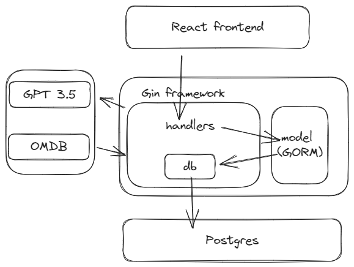
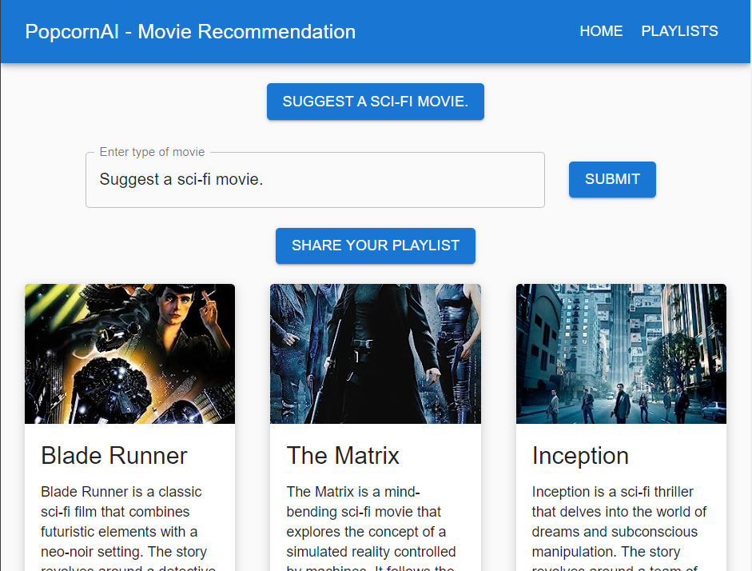
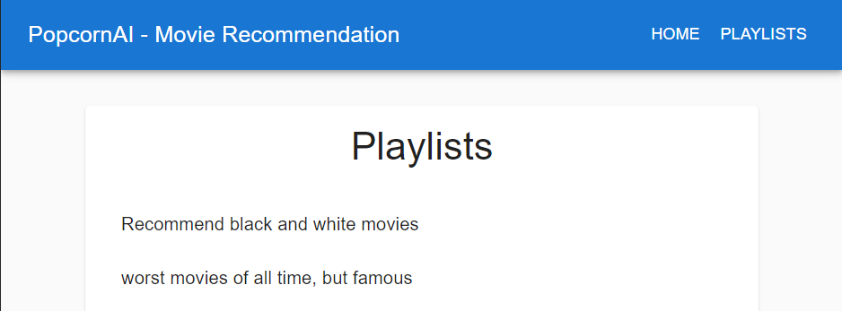
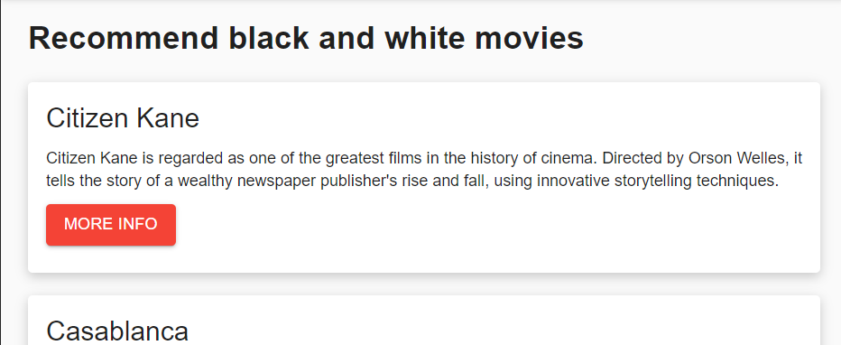
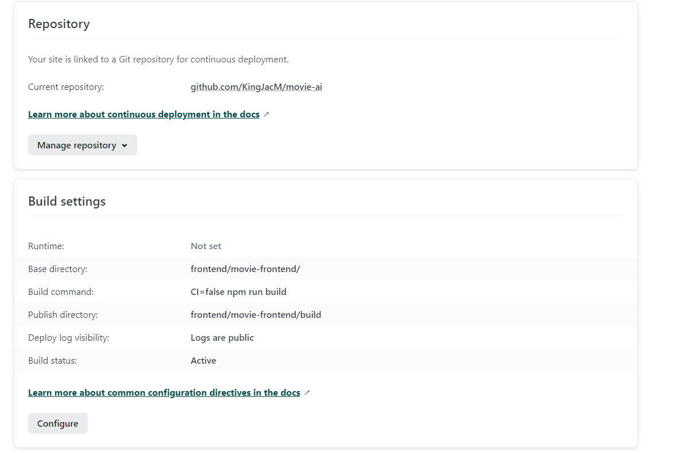
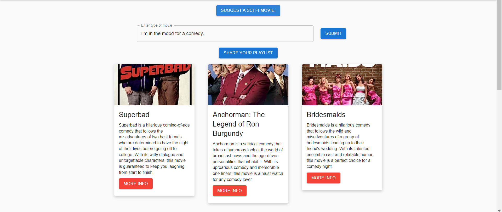

# PopcornAI: GPT Powered Movie recommendation (Frontend)

# 1. Background and Resources

### Background

This project is a web application designed for 2023 Microsoft Student Accelerator, and a practice of Golang and GORM/GIN framework for Bytedance Youth Camp. Used React for frontend

This document is about the full frontend design,

### System Design

This is the complete flowchart including frontend and backend


### Related Documents & Resources

#### Requirement:

The app must satisfy:

1. User able to enter prompt to search for movies
2. User able to click into the external link of movies
3. User is able to share the playlist
4. User is able to see all shared playlist by himself and others

#### Visuals:





#### Third-party Services/SDK Documentation:

https://mui.com/material-ui/

# 3. Design Proposals

### Overall Proposal

#### Project Setup

For frontend, common `npm install` and `npm start`

#### Deployment Plan

This will be deployed on Netlify.
https://app.netlify.com/sites/astounding-conkies-0006c3/configuration/deploys


#### Maintenance Plan

Frontend rarely need maintenence, if nessasary, replace the url in axios, which is hardcoded right now.

## Page Design

### 1. MainPage

#### Page Description

Shows suggestions, prompts input field and submit button, and render 9 movie cards after getting response, along with an additional share playlist button.

#### URL

/

#### UI & Interaction Logic (UI Split)



### 2. Playlist and playlist details page

#### Page Description

Shows playlist shared by users, when clicked in, shows specific playlist content, render by movie cards.

#### URL

/playlists
/playlists/{id}

#### UI


## Component Design

### 1. MainPage.js

#### Module Description

The MainPage component is the core component for interacting with an AI-based movie recommendation system. It is responsible for taking user input, communicating with an API to fetch movie recommendations, displaying the recommended movies, and providing the option to share the curated playlist. Also it is responsible for sending the handlers into the child component (Lifting State Upso that state is managed in the main page componen).

> #### Benefits
>
> 1. ensures there's a single source of truth. All child components receive the state and any changes to it from a single place. This makes the data flow in the app predictable and easier to trace.
> 2. **Reusability:** Child components remain stateless and purely presentational. This means they are more generic, reusable, and easier to test. They can be used in other parts of the app without worrying about internal state management.
>
> #### Drawbacks:
>
> 1. **Prop Drilling:** As your app grows, you might need to pass state and handlers through several layers of components. This is known as "prop drilling". It can make the code harder to maintain and understand. Context API and state management libraries like Redux or MobX can help alleviate this issue.
> 2. **Complexity in Parent:** The parent component can become bloated and overly complex if it's managing too many states and handlers.
> 3. **Less Flexibility for Child Components:** The child components depend on the parent for their data and actions. If a child component needs to behave differently in another context, it might require changes to the parent component or a different way of passing down props.

#### State/Props

**State:**

- `promptValue`: Stores the current value of the user's input.
- `movies`: Stores the list of movies fetched from the recommendation API.
- `isLoading`: Indicates if the component is in a loading state (i.e., waiting for the recommendations).
- `shared`: Indicates if the current playlist has been shared.
- `errorMessage`: Stores any error message that should be displayed.
- `snackbarOpen`: Controls the visibility of the error `Snackbar`.
- `successOpen`: Controls the visibility of the success `Snackbar` (playlist shared).
- `isSharing`: Indicates if the component is in the process of sharing the playlist.

**Props:** None.

#### Business Logic

- The user has the ability to input their preferences using a `TextField`.
- A dynamic suggestion button (`Suggestion` component) alternates between predefined movie prompts, which the user can click to quickly get recommendations.
- Once the user submits their preference, a loading indicator appears.
- Movies are then displayed in a card layout (`Movie` component) if successfully fetched.
- If there's an error during the recommendation fetch or playlist sharing process, an error message is displayed via a `Snackbar`.
- Once movies are displayed, the user has an option to share their playlist, which upon being clicked, will send the list to a separate API.
- `handleInputChange`: Updates `promptValue` based on user input.
- `handlePromptSubmit`: Makes an API request to get movie recommendations based on `promptValue`.
- `handleSharePlaylist`: Sends the curated movie list to a separate API.
- `handleSuggestionClick`: Sets the `promptValue` based on a suggestion.
- `handleCloseSnackbar`: Closes the `Snackbar` and resets the error message.

### 2. Movie.js

#### Module Description

The `Movie` component is responsible for displaying individual movie details in a card format.

#### UI & Interaction Logic

- The movie title, description, and an image (if available) are displayed on a card.
- There's a "more info" button that redirects the user to an external link with more information about the movie.

#### State/Props

**Props:**

- `movie`: An object containing the movie's details (`title`, `description`, `imageLink`, and `link`).

**State:** None.

#### Business Logic

The component primarily serves to render and format movie details provided via the `movie` prop.

The component returns a card layout containing the movie details and a "more info" button.

### 3. Prompt.js

#### Module Description

The `Prompt` component provides a UI for users to input their movie preferences and submit them.

#### UI & Interaction Logic

- Consists of a `TextField` for users to enter their preference.
- A "Submit" button is provided to initiate the recommendation fetching process.

#### State/Props

**Props:**

- `onSubmit`: A function that gets triggered when the user clicks the "Submit" button.
- `disabled`: A boolean that determines whether the input and button should be disabled (during loading states).
- `inputValue`: The current value of the input field.
- `onInputChange`: A function to handle changes to the input field value.

**State:** None.

#### Business Logic

The component captures user input and triggers the recommendation fetch process when the "Submit" button is clicked.

The component returns a layout with a text input and a "Submit" button.

### 4. Suggestion.js

#### Module Description

The `Suggestion` component displays dynamic movie prompts to users. These prompts cycle through predefined suggestions at regular intervals.

#### UI & Interaction Logic

- A button displays a movie prompt.
- Clicking on the button will use that prompt as the user's preference to fetch recommendations.

#### State/Props

**State:**

- `index`: Stores the current index of the suggestions array to determine which suggestion to display.

**Props:**

- `onSuggestionClick`: A function that gets triggered when a suggestion is clicked.
- `disabled`: A boolean to determine if the suggestion button should be disabled (during loading states).

#### Business Logic

- The component cycles through the predefined `suggestions` array, updating the displayed suggestion every 2 seconds.

```javascript
const [index, setIndex] = useState(0);

  useEffect(() => {
    const interval = setInterval(() => {
      setIndex((prevIndex) => (prevIndex + 1) % suggestions.length);
    }, 2000);
    return () => clearInterval(interval);
  }, []);
```

Inside the effect function, it sets up an interval using the `setInterval` function. The interval function increments the `index` value using the `setIndex` function, which is most likely a state updater. The new value of `index` is calculated by taking the previous value (`prevIndex`), adding 1, and then taking the modulus (`%`) of the length of the `suggestions` array. This ensures that the `index` value stays within the bounds of the array.

The interval function runs every 2000 milliseconds (or 2 seconds) as specified by the second argument of `setInterval`.

Finally, the effect function returns a cleanup function that clears the interval using the `clearInterval` function. This cleanup function will be called when the component is unmounted or before the effect runs again.

The component returns a button that displays the current suggestion from the suggestions array.

### 5. PlaylistPage.js

#### Module Description

The `PlaylistPage` component retrieves a list of movie playlists and displays them. Each playlist can be clicked to navigate to a detail page.

#### UI & Interaction Logic

- Uses the Material-UI `Paper` for the containing element.
- Displays a loading spinner (`CircularProgress`) centered within the `Paper` during the fetching process.
- Once data is fetched, it renders a list of playlists. Each playlist is a link that redirects to the playlist's detail page.
- If there's an error during the fetching process, a `Snackbar` is displayed with the error message.

#### State/Props

- **State**:
  - `playlists`: An array of playlists fetched from the server.
  - `isLoading`: Boolean that indicates if data is still being fetched.
  - `errorMessage`: A string to store any error messages during the fetch process.
  - `snackbarOpen`: Boolean that indicates if the `Snackbar` should be displayed.

#### Business Logic

- On component mount, the `fetchPlaylists` function is executed. This function sets `isLoading` to true, attempts to fetch playlists from a given URL, and then sets the fetched playlists to the `playlists` state. If there's an error, it sets the error message to `errorMessage` and shows the `Snackbar`.
- The `handleCloseSnackbar` function sets the `errorMessage` to an empty string and closes the `Snackbar`.

### 6. PlaylistDetailPage.js

#### Module Description

The `PlaylistDetailPage` component fetches and displays detailed information about a specific playlist based on an ID from the URL. This detail includes the name of the playlist and all movies contained within.

#### UI & Interaction Logic

- When the component is loaded, it fetches the playlist's details based on the ID from the URL.
- A loading spinner (`CircularProgress`) is shown centered on the page during the fetching process.
- After fetching, it displays the playlist's name and all movies within it using the `Movie` component.
- If there's an error during the fetch process, a `Snackbar` with the error message is displayed.

#### State/Props

- **State**:
  - `playlist`: Object containing the details of the playlist.
  - `isLoading`: Boolean that indicates if data is still being fetched.
  - `errorMessage`: A string to store any error messages during the fetch process.
  - `snackbarOpen`: Boolean that indicates if the `Snackbar` should be displayed.
- **Props**:
  - Uses the `useParams` hook from `react-router-dom` to retrieve the `id` prop from the URL.

#### Business Logic

- On component mount, the `fetchPlaylist` function is executed. This function sets `isLoading` to true, attempts to fetch the specific playlist's details based on the ID from the URL, and then sets the fetched details to the `playlist` state. If there's an error, it sets the error message to `errorMessage` and shows the `Snackbar`.
- The `handleCloseSnackbar` function sets the `errorMessage` to an empty string and closes the `Snackbar`.

#### Execution Flow:

1. Component is mounted.
2. Retrieves the `id` from the URL using the `useParams` hook.
3. Executes the `useEffect` hook which calls the `fetchPlaylist` function.
4. The `fetchPlaylist` function sets `isLoading` to true and starts fetching data.
5. If data is successfully fetched, `isLoading` is set to false, and the fetched data is set to the `playlist` state.
6. If an error occurs, `errorMessage` is set with the error message, `snackbarOpen` is set to true to show the error, and `isLoading` is set to false.
7. The UI then conditionally renders based on the `isLoading` state. If it's true, a loading spinner is shown. If false, the playlist's details are rendered.
8. If there's an error, the `Snackbar` is displayed with the error message and a "Close" button.

## Common Modules

The `App` component serves as the root component for this application. It provides the main structure and routing for the different pages in the app. Here's a breakdown of the component and its features:

### Theming with Material-UI

Before the actual `App` function component, we see a theme being created using Material-UI's `createTheme` function. This theme defines some custom colors for the primary and secondary palettes, as well as typography settings.

```jsx
const theme = createTheme({
  ...
});
```

The `ThemeProvider` component from Material-UI is then used to wrap the entire app, ensuring that any nested Material-UI components have access to the defined theme.

### React Router

The `App` component uses the React Router v6 library to define the routing structure for the app. The main components from the library used are:

- `Router`: Wraps the application and provides the context needed for the routing capabilities.
- `Routes`: A container for multiple `Route` components, which define individual routes.
- `Route`: Each `Route` component specifies a path and an element to render for that path.

```javascript
<Routes>
    <Route path="/" element={<MainPage />} />
    <Route path="/playlists" element={<PlaylistPage />} />
    <Route path="/playlists/:id" element={<PlaylistDetailPage />} />
</Routes>
```

### Navigation Bar

```javascript
<Toolbar>
    <Typography variant="h6" style={{ flexGrow: 1 }}>
        PopcornAI - Movie Recommendation
    </Typography>
    <Button color="inherit" component={Link} to="/">Home</Button>
    <Button color="inherit" component={Link} to="/playlists">Playlists</Button>
</Toolbar>
```

The application features an `AppBar` (which is a Material-UI component that represents a top app bar). Within the `AppBar` is a `Toolbar` that contains the app's title and navigation buttons.

- The app's title is "PopcornAI - Movie Recommendation".
- Two navigation buttons are provided:
  1. "Home" button that navigates to the base path `/`:
     ```jsx
     <Button color="inherit" component={Link} to="/">Home</Button>
     ```
  2. "Playlists" button that navigates to the `/playlists` path:
     ```jsx
     <Button color="inherit" component={Link} to="/playlists">Playlists</Button>
     ```

The `Link` component from React Router is used in conjunction with the `Button` component from Material-UI to create navigation buttons that function as links.
